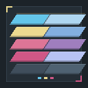

<div align="center">



<br/>

# FORGE &nbsp;·&nbsp; THEMES
> Colour crafted at the forge.

</div>

<div align="center">


</div>

---

## Overview

A VS Code colour theme collection built on the [Fynes Forge](https://github.com/fynes-forge) brand palette.

Every theme is written in TypeScript and compiled to VS Code–compatible JSON via a generator script — no hand-edited JSON, full type safety.
This is a Fynes Forge project built with **precision over cleverness**.

---

## Themes

### 🔩 Forge
The canonical brand experience. Deep workshop blues (`#1C2329`), lavender text, gold accents and pink highlights, exactly as defined in the Fynes Forge brand identity.

### ☀️ Dayforge
Crisp lavender-white background with brand colours deepened for full readability. The same DNA as Forge, adapted for bright environments.

### 🔥 Hearthforge
A warm dark counterpart. Charred brown backgrounds replace the cool blues, while brand lavender and cyan remain as cool sparks against the heat.

### ⚔️ Cold Forge
Maximum contrast dark theme. Near-black backgrounds, bright crisp text, and brand accent colours turned up to full saturation. For those who code in the void.

---

## Colour Palette

All themes derive from the Fynes Forge brand palette:

| Token         | Hex       | Role                    |
|---------------|-----------|-------------------------|
| Dark Blue     | `#404E5C` | Background              |
| Steel Blue    | `#4F6272` | Inactive / muted        |
| Lavender      | `#B7C3F3` | Main text               |
| Pink          | `#DD7596` | Keywords                |
| Gold          | `#ECDA90` | Accents / properties    |
| Light Blue    | `#83AFDF` | Strings                 |
| Bright Cyan   | `#63C5EA` | Functions               |
| Pale Blue     | `#AED6F1` | Parameters              |
| Deep Lavender | `#9F7EBE` | Punctuation / operators |
| Deep Pink     | `#D05786` | Constants / numbers     |

---

# Development

The themes are generated from TypeScript source files — never edit the JSON files directly.

### Prerequisites
- Node.js ≥ 18
- npm

### Setup

```bash
npm install
```

### Generate themes

```bash
npm run generate
```

This runs `src/generate.ts` via `ts-node` and writes all `*-color-theme.json` files into `./themes/`.

### Package as VSIX

```bash
npm run package
```

### Project structure

```
forge-themes/
├── src/
│   ├── palette.ts          ← Single source of truth for all brand colours
│   ├── types.ts            ← VS Code theme type definitions
│   ├── generate.ts         ← Generator script — run this to build JSON
│   ├── index.ts            ← Barrel export
│   └── themes/
│       ├── forge.ts            # Forge (dark)
│       ├── dayforge.ts         # Dayforge (light)
│       ├── hearthforge.ts      # Hearthforge (warm dark variant)
│       └── cold-forge.ts       # Cold Forge (high-contrast dark variant)
├── themes/                 ← Generated JSON (do not edit manually)
├── package.json
├── tsconfig.json
└── README.md
```

---

## Installation

### From Marketplace
1. Open VS Code → Extensions (`Ctrl+Shift+X`)
2. Search **Forged in Fynes**
3. Install, then open **Preferences: Color Theme** (`Ctrl+K Ctrl+T`)
4. Select your variant

### From VSIX
1. Download the latest `.vsix` from [Releases](https://github.com/fynes-forge/forged-in-fynes/releases)
2. Extensions panel → `...` → **Install from VSIX**

---

## Contributing

Contributions are welcome. Please read [CONTRIBUTING.md](./CONTRIBUTING.md) before opening a PR.

---

## Licence

MIT © [Fynes Forge](https://github.com/fynes-forge) — see [LICENSE](./LICENSE) for details.
